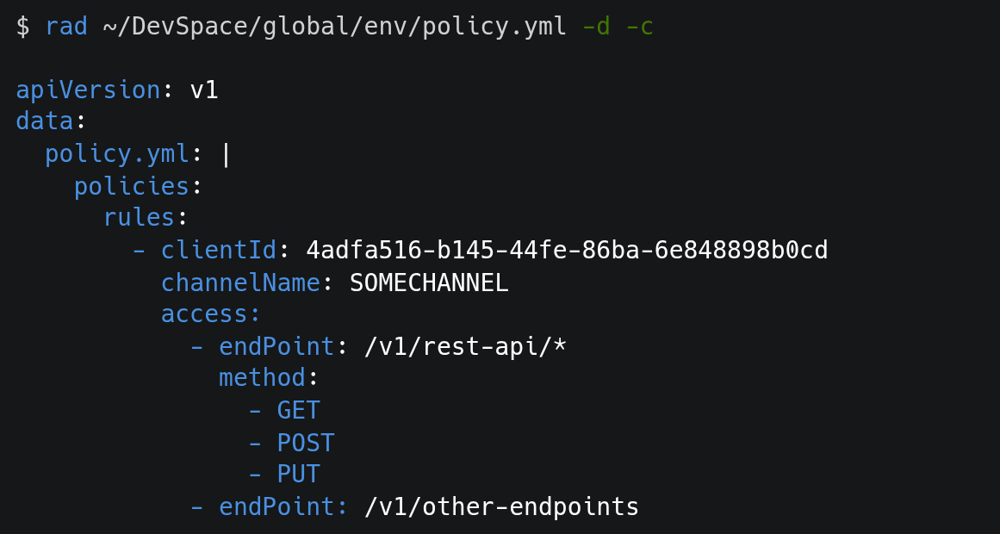

😎 Validate your Global Policy yaml files with EASE! 🤘🤘🤘

Made by SQ1

Ver: **RAD** 2026.08.29

Contributor / Maintainer: Brian **RAD**a

### TODO:

1. resizable box(_) depending on longest items  ✅
2. add option for executing kubectl commands ✅
3. add ANSI color codes for better visual ✅
4. implement kubectl command specifically for config maps ✅
5. terminal visualizer for processed and valid yaml files ✅

### + 1 Feature
**colorized yaml + 1** ✅

### Installation
#macOS
install using cask
```shell
brew trust Braeth/rad  && brew tap Braeth/rad && brew install --cask rad
```
after the installation, you'll see a message that you must run this command:
```shell
xattr -d com.apple.quarantine /<YOUR HOMEBREW PREFIX>/bin/rad
```
#windows
Download the latest binary(.exe) under releases page.

For easy reference to the binary, add it to your environment variables.

## About RAD

YAML is very sensitive when it comes to format and spacing. When I was adding/editing policy YAML files, I'm reluctant to send PRs and hope that it works in higher environments like UAT/PROD when it gets deployed. And the reason for this is that currently, our policy YAML file is so huge and it can grow in the future, and relying alone on IDE tools to underline/lint those lines is not enough, especially if the file is huge, and it might be difficult to catch those lines.

So I decided to develop a tool that mitigates those issues. That's how `RAD` came into existence. `RAD` is a CLI tool that will make sure your policy YAML files are valid.


## How to use RAD

To display all available arguments and how to use them you can type `--help` like so:

```shell
$ rad --help

Usage: rad YAML_FILE | rad [OPTIONS] YAML_FILE [YAML_FILE...]
  General Options:
    -h, --help                 Print this help text and exit
    -v, --version              Software version
    -r, --recursive            Validate multiple yaml files
    -d, --dry-run              Simulate kubectl --dry-run for configmaps

    -c, --color                Colorized the result for kubectl --dry-run command

e.g: $rad <path-to>/policy.yaml
```


## Ways to validate yaml files

If you want to check or validate if a policy yaml file is valid, simply pass the path of the yaml:

```shell
$ rad ~/DevSpace/global/env/policy.yml

INFO: SUCCESS! 1 file is VALID!
────────────────────────────────
| ..env/policy.yml   |  VALID  |
────────────────────────────────
```

**NOTE:**
> you can pass Absolute, relative and remote shared file paths


For some reason, if the policy yaml file is invalid, you'll get this output:

```shell
$ rad ~/DevSpace/global/env/policy.yml

Error from </home/bria...env/policy.yml>: did not find expected '-' indicator
Line: 1872 at column: 6
───────────────────────────────────────────────────────────
1870|         - endPoint: /v1/api/sample                   |
1871|           method: POST                               |
1872|     - clientId: 4adfa516-b145-44fe-86ba-6e848898b0cd |
          ~~~~~~~~~~~~~~~~~~~~~~~~~~~~~~~~~~~~~~~~~~~~~~~~ |
1873|      channelName: JNX                                |
1874|       access:                                        |
───────────────────────────────────────────────────────────

```

Depending on the error, it will point us to which line and column caused the error.

#### Validate multiple yaml files:

You can also validate multiple files at once by adding the `-r` (recursive) argument like so:

```shell
$ rad ~/DevSpace/global/env/policy.yml ~/DevSpace/global/env2/policy.yml ~/DevSpace/global/env3/policy.yml -r

INFO: SUCCESS! 3 files are VALID!
────────────────────────────────
| ..env/policy.yml   |  VALID  |
────────────────────────────────
| ..nv2/policy.yml   |  VALID  |
────────────────────────────────
| ..nv3/policy.yml   |  VALID  |
────────────────────────────────

```

**NOTE:**
> you can place arguments at any position you'd like, after you type `rad`


## Execute dry-run command

`rad` will also able to run dry-run command in `kubectl` . Not only that, it can also perform validation + dry-run, so first it will make sure your policy yaml file is valid, then perform the dry-run afterwards.

**NOTE:**
> `rad` expect that `kubectl` must be added in your system's environment variable, if it's not set, you'll get this error message:

```shell
$ rad ~/DevSpace/global/env/policy.yml -d

rad: kubectl was not installed. Please configure your environment variable.
```


If your `kubectl` is set, to perform a dry-run, just pass `-d` argument, and if the yaml is valid, it'll show something like this, just like when we run our `kubectl` configmaps command.
```shell
$ rad ~/DevSpace/global/env/policy.yml -d

apiVersion: v1
data:
  policy.yml: |
    policies:
      rules:
        - clientId: 4adfa516-b145-44fe-86ba-6e848898b0cd
          channelName: SOMECHANNEL
          access:
            - endPoint: /v1/rest-api/*
              method:
                - GET
                - POST
                - PUT
            - endPoint: /v1/other-endpoints
...
```


I've also added another argument that you may or may not like, but you can use it if you want, and that is to be able add colors in each keys.

Because I noticed that `kubectl` configmap commands, just produce a plain result, i was thinking, maybe adding colors to each keys might be interesting and you can easily spot the keys and values more easily.

If you want to add color simply add `-c` arguments in the command like so:



Just a sidenote, you can also pass arguments like this `-d -c` , `-dc` 
, `-c -d` or `-cd`


Thanks!


Brian


